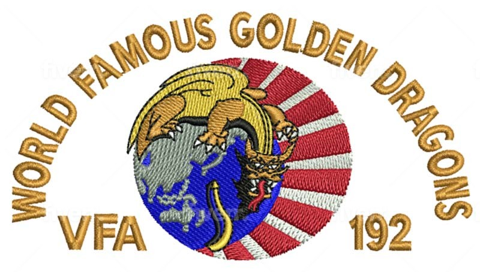

# Ballcap of Atsugi Era
VFA-192 was based in CVW-5 at NAF Atsugi Japan until 2009. During that time, the Squadron's logo was modified to have a dragon wrapped around the Asian Pacific. I am pictured below in the ballcap. 

## Licensing
The ballcap design files are licensed under Creative Commons and may be edited and distributed freely under the licensing. The original design falls under the public domain.

## Designer
Designer Adnan Mukati (https://www.fiverr.com/adnanmukati) and team recreated the embroidery files based on images found in the `Reference Files` folder.

